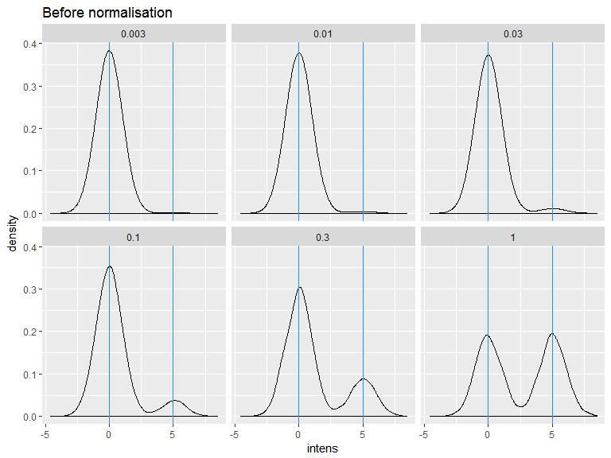
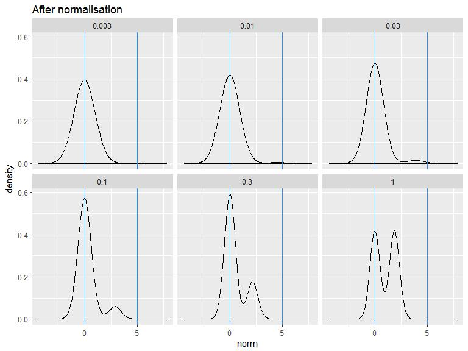

Normalization Effect
================
S. Granjeaud - CRCM
28 May 2018

-   [Simulation](#simulation)
-   [Before normalisation](#before-normalisation)
-   [Normalisation](#normalisation)
-   [After normalisation](#after-normalisation)
-   [Conclusion](#conclusion)

Simulation
----------

We examine the normalisation coefficient. We simulate samples with two populations, negative and positive, with the exact same peak dispersion and distance between peaks. The difference between the samples is the ratio of events of the positive to the negative population.

``` r
n = 1000  # Number of events of the smallest population
simulation = NULL
for (prop in c(1, 0.3, 0.1, 0.03, 0.01, 0.003)) {
  pop.pos = rnorm(n, mean = 5, sd = 1)
  pop.neg = rnorm(n/prop, mean = 0, sd = 1)
  simulation  = rbind(simulation,
                      data.frame(prop = prop, intens = c(pop.neg, pop.pos)))
}
dim(simulation)
```

    ## [1] 486999      2

``` r
head(simulation)
```

    ##   prop     intens
    ## 1    1 -0.1910389
    ## 2    1 -1.0682097
    ## 3    1  0.6208346
    ## 4    1  0.4786971
    ## 5    1 -1.3894545
    ## 6    1 -0.6294504

Before normalisation
--------------------

``` r
library(ggplot2)
ggplot(simulation, aes(x = intens)) + geom_density(bw = 0.3) + facet_wrap(~prop) + ggtitle("Before normalisation") + geom_vline(xintercept = c(0, 5), col = "dodgerblue")
```



Normalisation
-------------

``` r
library(magrittr)
library(dplyr)
```

    ## 
    ## Attaching package: 'dplyr'

    ## The following objects are masked from 'package:stats':
    ## 
    ##     filter, lag

    ## The following objects are masked from 'package:base':
    ## 
    ##     intersect, setdiff, setequal, union

``` r
# Normalize
simulation = simulation %>%
  group_by(prop) %>%
  mutate(norm = intens / sd(intens))
# Coefficients
simulation %>%
  group_by(prop) %>%
  summarise(mean = mean(intens), sd = sd(intens))
```

    ## # A tibble: 6 x 3
    ##    prop   mean    sd
    ##   <dbl>  <dbl> <dbl>
    ## 1 0.003 0.0137  1.04
    ## 2 0.01  0.0523  1.12
    ## 3 0.03  0.141   1.31
    ## 4 0.1   0.450   1.76
    ## 5 0.3   1.15    2.34
    ## 6 1     2.54    2.72

After normalisation
-------------------

``` r
ggplot(simulation, aes(x = norm)) + geom_density(bw = 0.3) + facet_wrap(~prop) + ggtitle("After normalisation") + geom_vline(xintercept = c(0, 5), col = "dodgerblue")
```



Conclusion
----------

When the positive population is small in comparison to the negative population, the estimated standard deviation is near the value of the standard deviation of the major population (ie, negative). Therefore the normalisation that consists in dividing by the estimated sd will the data nearly unchanged.

On the opposite, when the negative population becomes bigger, the overall sd becomes bigger. Therefore, the division squeezes the positive peak towards the negative peak.

In conclusion, the normalisation by the sd treats differently each parameter if the ratio of the positive population to the negative one is not similar across the parameters. The distance between postive and negative peaks after normalisation is not same depending on the ratio between positive and negative populations.
